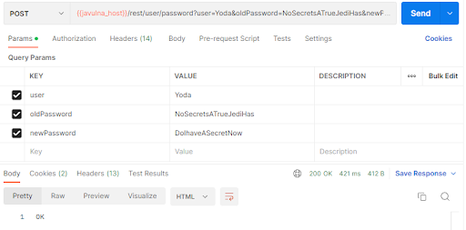
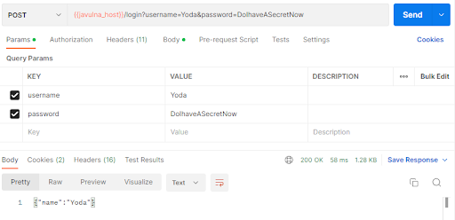
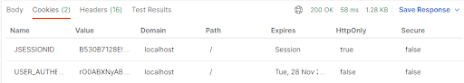

# Raport z audetu aplikacji "javulna"

## Spis treści

- [Raport z audetu aplikacji "javulna"](#raport-z-audetu-aplikacji-javulna)
  - [Spis treści](#spis-treści)
  - [Autorzy](#autorzy)
  - [Cel i zakres badań](#cel-i-zakres-badań)
    - [Cel i metodologia](#cel-i-metodologia)
    - [Zakres audytu](#zakres-audytu)
    - [Aplikacja](#aplikacja)
  - [Testowane komponenty](#testowane-komponenty)
  - [Przegląd wyników](#przegląd-wyników)
    - [A01:2021 - Broken Access Controls](#a012021---broken-access-controls)
    - [A02:2021 - Cryptographic Failures](#a022021---cryptographic-failures)
    - [03:2021 - Injection](#032021---injection)
    - [04:2021 - Insecure Design (przemyśleć)](#042021---insecure-design-przemyśleć)
    - [A05:2021 - Security Misconfiguration](#a052021---security-misconfiguration)
    - [A06:2021 - Vulnerable and Outdated Components](#a062021---vulnerable-and-outdated-components)
    - [07:2021 - Identification and Authentication Failures](#072021---identification-and-authentication-failures)
    - [A08:2021 - Software and Data Integrity Failures](#a082021---software-and-data-integrity-failures)
    - [A09:2021 - Security Logging \& Monitoring Failures](#a092021---security-logging--monitoring-failures)
    - [A10:2021 - Server-Side Request Forgery (SSRF)](#a102021---server-side-request-forgery-ssrf)
  - [Podsumowanie](#podsumowanie)
  - [ZAŁĄCZNIKI:](#załączniki)

## Autorzy

Wykonane przez:
1. Tytus Kołpak
2. Hubert Mosz
3. Łukasz Marcjan

Wersja raportu: V0.1

## Cel i zakres badań

### Cel i metodologia

Celem audytu była weryfikacja spełnienia standardu ASVS 4.0. na poziomie 2 przez aplikację JAVULNA oraz wytycznych według TOP 10 Web Application Security Risks wyznaczonych przez organizację OWASP, jako standard wymagań bezpieczeństwa wobec nowoczesnych aplikacji webowych.

OWASP Top 10 przedstawia szeroki przekrój najpopularniejszych podatności  związanych z zagrożeniem bezpieczeństwa, jakie można spotkać w aplikacjach webowych.

Metoda ta pozwala na  sprawdzenie zabezpieczeń implementacyjnych, jak i analizę architektury aplikacji webowych.

Application Security Verification Standard (ASVS) na poziomie 2 oferuje szerokie i dokładne sprawdzenie poprawności zabezpieczeń i jest zalecany dla większości aplikacji webowych.

### Zakres audytu

W audycie brane pod uwagę były podatności z listy OWASP TOP10.

| Numer kategori |               Nazwa kategori               |
| :------------: | :----------------------------------------: |
|    A01:2021    |           Broken Access Control            |
|    A02:2021    |           Cryptographic Failures           |
|    A03:2021    |                 Injection                  |
|    A04:2021    |              Insecure Design               |
|    A05:2021    |         Security Misconfiguration          |
|    A06:2021    |     Vulnerable and Outdated Components     |
|    A07:2021    | Identification and Authentication Failures |
|    A08:2021    |    Software and Data Integrity Failures    |
|    A09:2021    |   Security Logging & Monitoring Failures   |
|    A10:2021    |     Server-Side Request Forgery (SSRF)     |

### Aplikacja

[Aplikacja javulna](https://github.com/edu-secmachine/javulna) jest celowo podatną aplikacją Java. Jest stworzony do celów edukacyjnych. Przeznaczony jest głównie dla programistów Java. Javulna to aplikacja związana z filmem, gdzie można się zalogować i wylogować, przeczytać informacje o filmach, kupić przedmioty związane z filmem, wysyłać wiadomości do innych użytkowników aplikacji, itp. Funkcje te są dalekie od kompletności lub spójności, a ich celem jest jedynie wskazanie konkretnych słabych punktów. 

## Testowane komponenty

| Kategoria OWASP Top 10 | Przetestowane | Zgodne | Niezgodne |
| :--------------------: | :-----------: | :----: | :-------: |
|        A01:2021        |       -       |   -    |     -     |
|        A02:2021        |       -       |   -    |     -     |
|        A03:2021        |       -       |   -    |     -     |
|        A04:2021        |       -       |   -    |     -     |
|        A05:2021        |       -       |   -    |     -     |
|        A06:2021        |       -       |   -    |     -     |
|        A07:2021        |       -       |   -    |     -     |
|        A08:2021        |       -       |   -    |     -     |
|        A09:2021        |       -       |   -    |     -     |
|        A10:2021        |       -       |   -    |     -     |

## Przegląd wyników

### A01:2021 - Broken Access Controls

**Poziom ryzyka**: 4/5

**Rekomendacje**: Zastosować algorytm ARGON2, Wprowadzić role użytkowników i ich uprawnienia.

1. Każdy ma dostęp do haseł i nazw użytkownika innych użytkowników.

Poprzez specyficzną modyfikację zapytania /rest/movie można otrzymać wgląd do tabeli APPUSER: 

```SQL
insert into appuser (id, name, sex, emailaddress, password, webpageurl, motto) values ('1', 'Yoda', 'm', 'yoda@lucasarts.com', 'NoSecretsATrueJediHas', 'http://www.starwars.com/databank/yoda', 'I don''t know how old I am.');
```

A następnie się zalogować przy użyciu tych danych:


2. Można uzyskać dostęp do cudzych danych przez zmianę adresu url.

Podanie: `{{javulna_host}}/rest/movie` ,zamiast: `{{javulna_host}}/rest/movie?title=<title>&description=<desc>&genre=<genre>&id=<id>`, np: `{{javulna_host}}/rest/movie?title=Empire&description=Luke` bez specyfikacji dalszych parametrów skutkuje wydaniem całej treści bazy danych filmów.

3. Ktoś nieautoryzowany może edytować cudze dane
4. Podszywanie się pod administratora bez zezwolenia.

### A02:2021 - Cryptographic Failures

**Poziom ryzyka**: 4/5

**Rekomendacje**: Wprowadzić algorytm ARGON2

1. Brak szyfrowania haseł

```SQL
NoSecretsATrueJediHas:
insert into appuser (id, name, sex, emailaddress, password, webpageurl, motto) values ('1', 'Yoda', 'm', 'yoda@lucasarts.com', 'NoSecretsATrueJediHas', 'http://www.starwars.com/databank/yoda', 'I don''t know how old I am.');

IamYourFather:
insert into appuser (id, name, sex, emailaddress, password, webpageurl, motto) values ('2', 'Darth Vader', 'm', 'darth@lucasarts.com', 'IamYourFather', 'http://www.starwars.com/databank/darth-vader', 'I see a red door and I want it paint it back');

IwishIhaveChoosenTheWookieInstead:
insert into appuser (id, name, sex, emailaddress, password, webpageurl, motto) values ('3', 'Princess Leia', 'f', 'lea@lucasarts.com', 'IwishIhaveChoosenTheWookieInstead', 'http://starwars.wikia.com/wiki/Leia_Organa_Solo', '');
```

### 03:2021 - Injection

**Poziom ryzyka**: 5/5

**Rekomendacje**: Uniemożliwienie używania substringów w bazie danych, korzystanie z frameworków, bibliotek lub narzędzi do tworzenia zapytań HTTP dla Javy

```Java
public List<MovieDto> findMovie(String title, String description, String genre, String id) {
    int conditions = 0;
    StringBuilder sql = new StringBuilder("select description, title, genre, id 
    from movie ");
    if (StringUtils.hasText(title)) {
        appendCondition(sql, conditions);
        conditions++;
        sql.append("title LIKE '%").append(title).append("%'");
    }
    if (StringUtils.hasText(description)) {
        appendCondition(sql, conditions);
        conditions++;
        sql.append("description LIKE '%").append(description).append("%'");
    }
    if (StringUtils.hasText(genre)) {
        appendCondition(sql, conditions);
        conditions++;
        sql.append("genre LIKE '%").append(genre).append("%'");
    }
    if (StringUtils.hasText(id)) {
        appendCondition(sql, conditions);
        conditions++;
        sql.append("id = '").append(id).append("'");
    }
    LOG.debug(sql.toString());
    List<MovieDto> users = this.jdbcTemplate.query(sql.toString(), new 
    RowMapper<MovieDto>() {
        @Override
        public MovieDto mapRow(ResultSet rs, int rowNum) throws SQLException {
            MovieDto ret = new MovieDto();
            ret.setDescription(rs.getString("description"));
            ret.setTitle(rs.getString("title"));
            ret.setGenre(rs.getString("genre"));
            ret.setId(rs.getString("id"));
            return ret;
        }
    });

    return users;
}
private void appendCondition(StringBuilder sb, int conditions) {
    if (conditions == 0) sb.append(" where ");
    else sb.append(" and ");
}
```

1. Pobieranie zapytań do bazy danych, poprzez tworzenie zwykłych zapytań SQL’a.

`{{javulna_host}}/rest/movie?id=1' UNION SELECT id AS id, name AS title, password AS description, emailaddress AS genre FROM APPUSER-–`

```XML
<List>
    <item>
        <id>yoda@lucasarts.com</id>
        <title>Yoda</title>
        <description>1</description>
        <genre>NoSecretsATrueJediHas</genre>
    </item>
    <item>
        <id>darth@lucasarts.com</id>
        <title>Darth Vader</title>
        <description>2</description>
        <genre>IamYourFather</genre>
    </item>
    <item>
        <id>lea@lucasarts.com</id>
        <title>Princess Leia</title>
        <description>3</description>
        <genre>IwishIhaveChoosenTheWookieInstead</genre>
    </item>
    <item>
        <id>1</id>
        <title>Star Wars - A new hope</title>
        <description>Luke Skywalker joins forces with a Jedi Knight, a cocky pilot, a Wookiee, and two droids to save the galaxy from the Empires world-destroying battle-station, while also attempting to rescue Princess Leia from the evil Darth Vader.</description>
        <genre> Action, Adventure, Fantasy</genre>
    </item>
</List>
```

2. Tworzone zapytania SQL, są ze sobą “sklejane”, przez co są podatne na ataki.

### 04:2021 - Insecure Design (przemyśleć)

**Poziom ryzyka**: 0/5

**Rekomendacje**: Zastosowanie 2FA - w postaci przykładowo wysyłania maila w momencie próby zmiany hasła, z linkiem do potwierdzenia “Tak to ja” / SMS z kodem pozwalającym na zmianę hasła “Wpisz właśnie otrzymany kod w SMS”. Przekazywanie danych w ciele zapytania, nie w parametrach.

Po dostępie do danych użytkowników , można zmienić hasło takiego użytkownika na dowolne nowe, a następnie przy jego użyciu zalogować się na jego konto.

1. Zmiana hasła z rezultatem “OK”.



2. Logowanie na cudze konto przy pomocy nowego hasła.




### A05:2021 - Security Misconfiguration

**Poziom ryzyka**: 0/5 
**Rekomendacje**: -

Nie znaleziono plików, które nie powinny być widoczne dla przeciętnego użytkownika, takich jak: 
- .git
- Backupy
- Logi
- Tymczasowe pliki z edytorów tekstu ✔️

:japanese_goblin:

### A06:2021 - Vulnerable and Outdated Components

**Poziom ryzyka**: 3/5
**Rekomendacje**: Regularne uaktualnianie wersji komponentów

1. org.apache.commons > commons-collections4


Rys. Wersja używana w programie


Rys.Aktualna wersja ze strony `mvnrepository.com`


Rys. Znane podatności wersji 4.0

CVE-2020-15250:
- CWE - 732 (desc.): The product specifies permissions for a security-critical resource in a way that allows that resource to be read or modified by unintended actors.
- CWE - 200 (desc.): The product exposes sensitive information to an actor that is not explicitly authorized to have access to that information.

CVE-2015 -7501 oraz -6420:
- CWE - 502 (description): The application deserializes untrusted data without sufficiently verifying that the resulting data will be valid.

2. Sprign boot


Rys. Wersja używana w programie


Rys. Aktualna wersja ze strony wydawcy

Spring boot aktualizuje wersje co około pół roku i gwarantuje wsparcie przez rok od daty wydania. Dlatego należy aktualizować ten komponent co najmniej co 12 miesięcy.

### 07:2021 - Identification and Authentication Failures 
**Poziom ryzyka**: 4/5

**Rekomendacje**: Zastosowanie algorytmu ARGON2, Wprowadzenie mechanizmu 2FA.

1. brak 2FA / MFA - ❌
2. brak kont testowych admin/admin - ❌
3. hasła są przechowywane jako plain text bez algorytmu kryptograficznego - ❌
4. jakość haseł nie jest kontrolowana (typu wymagane: 8 liter, 1 cyfra, 1 znak specjalny  - “qwerty” jest dostępne) - ❌
   1. przykładowo: brak 🧂solenia haseł przed haszowaniem jak w np: ARGON2

### A08:2021 - Software and Data Integrity Failures 
**Poziom ryzyka**: 1/5

**Rekomendacje**: -

1. Wszystkie wtyczki, biblioteki i moduły pochodzą z zaufanych źródeł ✔️
2. Brak aktualizacji ❌ (W tym przypadku nie ma aktualizacji, ale też nie są potrzebne, ponieważ strona nie jest “żywa” nic się tam nie zmienia, nie ma ruchu)
3. Brak niebezpiecznej serializacji/deserializacji (modyfikacji danych z postaci obiektu w javie na np plik typu JSON / na odwrót) ✔️

### A09:2021 - Security Logging & Monitoring Failures
**Poziom ryzyka**: 4/5

**Rekomendacje**: Dodanie mechanizmu bezpiecznego tworzenia i przechowywania logów aplikacji - podać konkretne rozwiązania

1. Brak jakiejkolwiek formy log’ów oraz wypisywania danych na temat zaistniałych eventów ❌
2. Brak mechanizmu monitorowania błędów / awarii ❌

### A10:2021 - Server-Side Request Forgery (SSRF)
**Poziom ryzyka**: 4/5

**Rekomendacje**: Utworzenie systemu walidacji przesyłanych plików, np. przy użyciu odpowiednich bibliotek (podać jakie biblioteki)

1. Otwarta funkcjonalność wysyłania plików bezpośrednio do folderu na serwerze ❌ 
2. Potencjalna możliwość pobierania plików z dowolnego katalogu na serwerze ❌
3. Aplikacja nie sprawdza poprawności adresu URL podanego przez użytkownika ❌
Brak weryfikacji zawartości pliku ❌ 


## Podsumowanie

Audyt aplikacji “Javulna” realizowany był na podstawie 10 najistotniejszych ryzyk odnośnie bezpieczeństwa, wyznaczonych przez organizację OWASP (The Open Web Application Security Project) i ich listy [TOP10](https://owasp.org/www-project-top-ten/).

## ZAŁĄCZNIKI:
- paragraf opisu teoretycznego
- wskazanie miejsca w kodzie gdzie jest podatność
- walidacja danych, XSS
- rozwiązania typu Cors
- konfiguracja cookiesow
- mechanizm autoryzacji użytkowników
- path traversal (23 slajd)
- czy są podejrzane katalogi, ocenić strukturę - aplikacji / architekturę
- content security policy (slajd 33)
- hijacking (slajd 42) - konf osadzania strony w ramkach
- gdzie ta baza danych jest
- rest api? JWT?
- doczytac jak działa SSRF