# Raport z audetu aplikacji "javulna"

## Spis treści

- [Raport z audetu aplikacji "javulna"](#raport-z-audetu-aplikacji-javulna)
  - [Spis treści](#spis-treści)
  - [Autorzy](#autorzy)
  - [Podsumowanie](#podsumowanie)
  - [Cel i zakres badań](#cel-i-zakres-badań)
    - [Cel i metodologia](#cel-i-metodologia)
    - [Zakres audytu](#zakres-audytu)
    - [Aplikacja](#aplikacja)
  - [Testowane komponenty](#testowane-komponenty)
  - [Przegląd wyników](#przegląd-wyników)
    - [A01:2021 - Broken Access Controls](#a012021---broken-access-controls)
    - [A02:2021 - Cryptographic Failures](#a022021---cryptographic-failures)
    - [A03:2021 - Injection](#a032021---injection)
    - [A04:2021 - Insecure Design](#a042021---insecure-design)
    - [A05:2021 - Security Misconfiguration](#a052021---security-misconfiguration)
    - [A06:2021 - Vulnerable and Outdated Components](#a062021---vulnerable-and-outdated-components)
    - [A07:2021 - Identification and Authentication Failures](#a072021---identification-and-authentication-failures)
    - [A08:2021 - Software and Data Integrity Failures](#a082021---software-and-data-integrity-failures)
    - [A09:2021 - Security Logging \& Monitoring Failures](#a092021---security-logging--monitoring-failures)
    - [A10:2021 - Server-Side Request Forgery (SSRF)](#a102021---server-side-request-forgery-ssrf)
    - [Wykonane prace](#wykonane-prace)

## Autorzy

Wykonane przez:
1. Tytus Kołpak
2. Hubert Mosz
3. Łukasz Marcjan

Wersja raportu: V1.0

## Podsumowanie

Audyt ukazuje jakość aplikacji *Javulna* (związanej z filmami) pod względem jej bezpieczeństwa rozumianego tożsamo z wytycznymi organizacji OWASP i ich listy TOP10. Autorzy ninejszego audytu wykonywali pracę w okresie 20 października 2022 - 5 styczeń 2023. Prace były wykonywane z pomocą aplikacji takich jak `Postman v9.4` i `IntelliJ IDEA 2022.1`. Audyt przeprowadzany był poprzez wykorzystanie funkcji aplikacj Javulna w Postmanie, a następnie sprawdzone zostały: poprawność i charakter ich działania. Przeprowadzono przegląd kodu w celu wyszukania błędnej bądź niekompletnej implementacji odpowiednich elementów logiki działania w IntelliJ.

Ogólny poziom bezpieczeństwa można określić jako średnio-wysoki, a aplikację jako nadajacą się do reewaluacji i poprawy zgodnie z wylistowanymi rekomendacjami. Większość wskazówek w rekomendacjach powinna być prosta do implementacji, ponieważ polega na dodaniu odpowiedniego elementu do już istniejącego kodu. Najistotniejszą kwestią jest dodanie algorytmu kryptograficznego (rekomendujemy ARGON2) ponieważ on sam zwalczy problemy z kilku kategorii.

| Kategoria OWASP Top 10 | poziom ryzyka |
| :--------------------: | :-----------: |
|        A01:2021        |      4/5      |
|        A02:2021        |      4/5      |
|        A03:2021        |      5/5      |
|        A04:2021        |      2/5      |
|        A05:2021        |      1/5      |
|        A06:2021        |      5/5      |
|        A07:2021        |      4/5      |
|        A08:2021        |      1/5      |
|        A09:2021        |      4/5      |
|        A10:2021        |      0/5      |
|      Sumarycznie       |     30/50     |

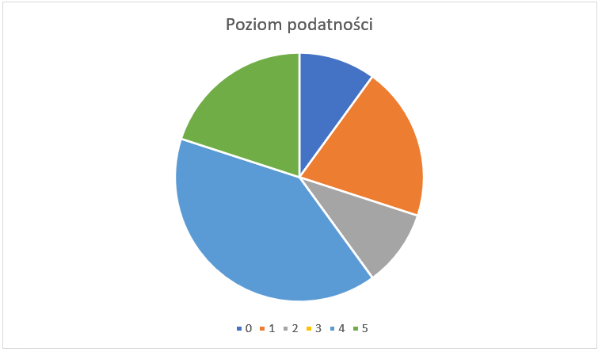

## Cel i zakres badań

### Cel i metodologia

Celem audytu była weryfikacja spełnienia standardu ASVS 4.0. na poziomie 2 przez aplikację JAVULNA oraz wytycznych według TOP 10 Web Application Security Risks wyznaczonych przez organizację OWASP, jako standard wymagań bezpieczeństwa wobec nowoczesnych aplikacji webowych.

OWASP Top 10 przedstawia szeroki przekrój najpopularniejszych podatności  związanych z zagrożeniem bezpieczeństwa, jakie można spotkać w aplikacjach webowych.

Metoda ta pozwala na  sprawdzenie zabezpieczeń implementacyjnych, jak i analizę architektury aplikacji webowych.

Application Security Verification Standard (ASVS) na poziomie 2 oferuje szerokie i dokładne sprawdzenie poprawności zabezpieczeń i jest zalecany dla większości aplikacji webowych.

### Zakres audytu

W audycie brane pod uwagę były podatności z listy OWASP TOP10.

| Numer kategorii |               Nazwa kategori               |
| :-------------: | :----------------------------------------: |
|    A01:2021     |           Broken Access Control            |
|    A02:2021     |           Cryptographic Failures           |
|    A03:2021     |                 Injection                  |
|    A04:2021     |              Insecure Design               |
|    A05:2021     |         Security Misconfiguration          |
|    A06:2021     |     Vulnerable and Outdated Components     |
|    A07:2021     | Identification and Authentication Failures |
|    A08:2021     |    Software and Data Integrity Failures    |
|    A09:2021     |   Security Logging & Monitoring Failures   |
|    A10:2021     |     Server-Side Request Forgery (SSRF)     |

### Aplikacja

[Aplikacja javulna](https://github.com/edu-secmachine/javulna) jest celowo podatną aplikacją Java (v8). Jest stworzona do celów edukacyjnych oraz dostarczoona w postaci kodu źródłowego. Przeznaczona jest głównie dla programistów Java. Javulna w wersji V1.0 to aplikacja związana z filmami, w której można się zalogować i wylogować, przeczytać informacje o filmach, kupić przedmioty związane z filmem, wysyłać wiadomości do innych użytkowników aplikacji, itp. Funkcje te są dalekie od kompletności lub spójności, a ich celem jest jedynie wskazanie konkretnych słabych punktów. 

Jest to standardowa aplikacja działająca w oparciu o Spring Boot (v2.7.5) i budowana jest ona z użyciem Maven. Wykorzystuje serwer Tomcata w podstawowej konfiguracji, aby udostępnić REST-owe endpointy - wypisane poniżej:
- Login / Logout
- Create Movie (with XML) (with param)
- Change Password
- List users / movies
- Create / modify user
- List Chat Messages
- Buy movie objects
- List buyable movie objects
- Download / Upload File,
do których dostęp jest umożliwiony np.: z poziomu aplikacji Postman.

## Testowane komponenty

| Kategoria OWASP Top 10 | Przetestowane | Zgodne | Niezgodne |
| :--------------------: | :-----------: | :----: | :-------: |
|        A01:2021        |       ✔       |        |     ❌     |
|        A02:2021        |       ✔       |        |     ❌     |
|        A03:2021        |       ✔       |        |     ❌     |
|        A04:2021        |       ✔       |        |     ❌     |
|        A05:2021        |       ✔       |   ✔    |           |
|        A06:2021        |       ✔       |        |     ❌     |
|        A07:2021        |       ✔       |        |     ❌     |
|        A08:2021        |       ✔       |   ✔    |           |
|        A09:2021        |       ✔       |        |     ❌     |
|        A10:2021        |       ✔       |   ✔    |           |

## Przegląd wyników

### A01:2021 - Broken Access Controls

**Poziom ryzyka**: 4/5

**Opis**: Dane logowania użytkowników zapisywane są bez algorytmów kryptograficznych, co pozwala na uzyskanie dostępu do nazw i haseł. Brak ról użytkowników oraz ich możliwości dostępowych wiąże się z niebezpieczeństwem podszywania się pod konto administratora i zmiany plików konfiguracyjnych programu.

1. Każdy ma dostęp do haseł i nazw użytkownika innych użytkowników.

Poprzez specyficzną modyfikację zapytania /rest/movie można otrzymać wgląd do tabeli APPUSER: 

```SQL
insert into appuser (id, name, sex, emailaddress, password, webpageurl, motto) values ('1', 'Yoda', 'm', 'yoda@lucasarts.com', 'NoSecretsATrueJediHas', 'http://www.starwars.com/databank/yoda', 'I don''t know how old I am.');
```

A następnie się zalogować przy użyciu tych danych:

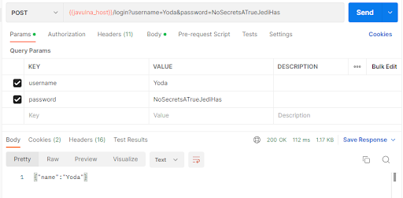

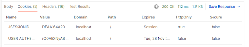

2. Można uzyskać dostęp do cudzych danych przez zmianę adresu url.

Podanie: `{{javulna_host}}/rest/movie` ,zamiast: `{{javulna_host}}/rest/movie?title=<title>&description=<desc>&genre=<genre>&id=<id>`, np: `{{javulna_host}}/rest/movie?title=Empire&description=Luke` bez specyfikacji dalszych parametrów skutkuje wydaniem całej treści bazy danych filmów.

3. Ktoś nieautoryzowany może edytować cudze dane
4. Podszywanie się pod administratora bez zezwolenia.

**Rekomendacje**: 
1. Podatność: Każdy może uzyskać dostęp do haseł i nazw użytkownika innych użytkowników.
   1. Rozwiązanie: Zmienić lokalizację przechowywanych danych poufnych na chronioną (np. poprzez pominięcie wysłania jej do publicznego repo tak jak pomija się pliki z .gitignore). Przechowywać najważniejsze elementy - `name` i `password` w postaci zaszyfrowanej przy pomocy algorytmu ARGON2, zamiast postaci plain text.
2. Podatność: Ktoś nieautoryzowany może edytować cudze dane.
   1. Rozwiązanie: Jeżeli dojdzie do wypływu danych takich jak `name` i `password` to dodatkowo można zapewnić ich bezpieczeństwo poprzez dodanie 2FA - uwierzytelniania dwuskładnikowego (prośba potwierdzenia operacji zmiany danych SMSem bądź e-mailem). W ten sposób sprawi się, że one same będą niewystarczające do zmiany ich samych.
3. Podatność: Każdy może podszyć się pod administratora bez zezwolenia
   1. Rozwiązanie: Dodanie ról użytkowników - pozwalających na rozróżnienie, użytkowników i przydzielenie im adekwatnych pozwoleń. 
4. Podatność: XSS.
   1. Rozwiązanie: Wprowadzić filtrowanie tagów html'owych w linkach. Sprawdzać przesyłane dane przez użytkowników.


### A02:2021 - Cryptographic Failures

**Poziom ryzyka**: 4/5

**Opis**: Dane wrażliwe użytkownika, służące do obsługi konta w aplikacji, są zapisywane jako ciąg znaków podanych przez użytkownika. Zaimplementowany mechanizm ich obsługi ma liczne braki w kontekście ich zabezpieczeń, takie jak:
- Brak mechanizmu szyfrującego hasła i danych wrażliwych
- Brak algorytmu kryptograficznego
- Dane użytkownika są przesyłane jawnie przez zapytanie

1. Brak szyfrowania haseł

```SQL
NoSecretsATrueJediHas:
insert into appuser (id, name, sex, emailaddress, password, webpageurl, motto) values ('1', 'Yoda', 'm', 'yoda@lucasarts.com', 'NoSecretsATrueJediHas', 'http://www.starwars.com/databank/yoda', 'I don''t know how old I am.');

IamYourFather:
insert into appuser (id, name, sex, emailaddress, password, webpageurl, motto) values ('2', 'Darth Vader', 'm', 'darth@lucasarts.com', 'IamYourFather', 'http://www.starwars.com/databank/darth-vader', 'I see a red door and I want it paint it back');

IwishIhaveChoosenTheWookieInstead:
insert into appuser (id, name, sex, emailaddress, password, webpageurl, motto) values ('3', 'Princess Leia', 'f', 'lea@lucasarts.com', 'IwishIhaveChoosenTheWookieInstead', 'http://starwars.wikia.com/wiki/Leia_Organa_Solo', '');
```
2. Nie znaleziono: Access-Control-Allow-Origin – pomimo, że jest wymagany

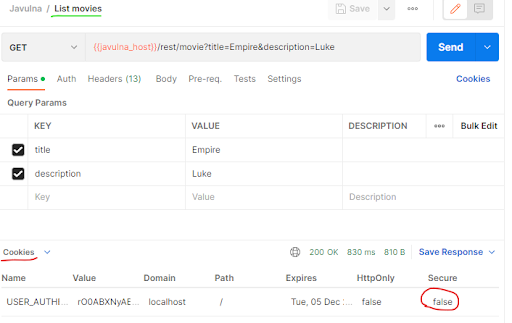
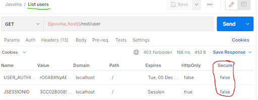
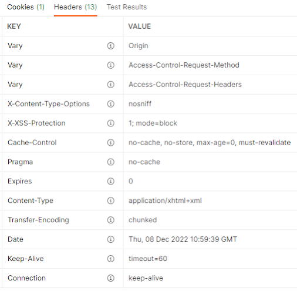

**Rekomendacje**: 
1. Podatność: Brak szyfrowania haseł.
   1. Rozwiązanie: Jak w sekcji A01, rekomendacje: punkt 1. 
2. Podatność: Brak Access-Control-Allow-Origin
   1. Rozwiązanie: Dodać Access-Control-Allow-Origin oraz rozważyć dodanie Access-Control-Allow-Credentials, Access-Control-Expose-Header

### A03:2021 - Injection

**Poziom ryzyka**: 5/5

**Opis**: Jest to podatność polegająca na niedostatecznym filtrowaniu i sprawdzaniu danych podanych przez użytkownika, które następnie są wykorzystywane do tworzenia zapytania SQL'owego. Aplikacja nie wykorzystuje żadnych frameworków do obrony przed szkodliwymi ciągami znaków (jak np. 'OR 1=1' lub 'DROP TABLE'), co stwarza duże niebezpieczeństwo wycieku danych lub ich destrukcji.

```Java
public List<MovieDto> findMovie(String title, String description, String genre, String id) {
    int conditions = 0;
    StringBuilder sql = new StringBuilder("select description, title, genre, id 
    from movie ");
    if (StringUtils.hasText(title)) {
        appendCondition(sql, conditions);
        conditions++;
        sql.append("title LIKE '%").append(title).append("%'");
    }
    if (StringUtils.hasText(description)) {
        appendCondition(sql, conditions);
        conditions++;
        sql.append("description LIKE '%").append(description).append("%'");
    }
    if (StringUtils.hasText(genre)) {
        appendCondition(sql, conditions);
        conditions++;
        sql.append("genre LIKE '%").append(genre).append("%'");
    }
    if (StringUtils.hasText(id)) {
        appendCondition(sql, conditions);
        conditions++;
        sql.append("id = '").append(id).append("'");
    }
    LOG.debug(sql.toString());
    List<MovieDto> users = this.jdbcTemplate.query(sql.toString(), new 
    RowMapper<MovieDto>() {
        @Override
        public MovieDto mapRow(ResultSet rs, int rowNum) throws SQLException {
            MovieDto ret = new MovieDto();
            ret.setDescription(rs.getString("description"));
            ret.setTitle(rs.getString("title"));
            ret.setGenre(rs.getString("genre"));
            ret.setId(rs.getString("id"));
            return ret;
        }
    });

    return users;
}
private void appendCondition(StringBuilder sb, int conditions) {
    if (conditions == 0) sb.append(" where ");
    else sb.append(" and ");
}
```

Odpytywanie bazy danych jest możliwa poprzez wystawione endpointy, umożliwiające komunikacje. Pobieranie treści z bazy danych odbywa się poprzez tworzenie zwykłych zapytań SQL'a. Tworzone zapytania SQL, są ze sobą "sklejane", przez co są podatne na niechciane ataki.

```
`{{javulna_host}}/rest/movie?id=1' UNION SELECT id AS id, name AS title, password AS description, emailaddress AS genre FROM APPUSER-–`
```

```XML
<List>
    <item>
        <id>yoda@lucasarts.com</id>
        <title>Yoda</title>
        <description>1</description>
        <genre>NoSecretsATrueJediHas</genre>
    </item>
    <item>
        <id>darth@lucasarts.com</id>
        <title>Darth Vader</title>
        <description>2</description>
        <genre>IamYourFather</genre>
    </item>
    <item>
        <id>lea@lucasarts.com</id>
        <title>Princess Leia</title>
        <description>3</description>
        <genre>IwishIhaveChoosenTheWookieInstead</genre>
    </item>
    <item>
        <id>1</id>
        <title>Star Wars - A new hope</title>
        <description>Luke Skywalker joins forces with a Jedi Knight, a cocky pilot, a Wookiee, and two droids to save the galaxy from the Empires world-destroying battle-station, while also attempting to rescue Princess Leia from the evil Darth Vader.</description>
        <genre> Action, Adventure, Fantasy</genre>
    </item>
</List>
```

**Rekomendacje**: 
- Do tworzenia zapytania użyć Prepared Statement - [Java JDBC](https://docs.oracle.com/javase/tutorial/jdbc/basics/index.html).
- Uniemożliwienie używania substringów w bazie danych, korzystanie z frameworków, bibliotek lub narzędzi do tworzenia zapytań HTTP dla Javy

### A04:2021 - Insecure Design

**Poziom ryzyka**: 2/5

**Opis**: Testowany program jest prostą aplikacją, która używa RestAPI oraz lokalną bazę danych oraz nie posiada skomplikowanej architektury wymagającej użycia wzorców projektowych, ani architektur referencyjnych.

Aplikacja nie sprawdza czy pliki pobierane są ze schematów innych niż http/https. Dodatkowo nie zastosowano żadnej biblioteki do sprawdzania rozszerzenia i zawartości przesyłanych plików. (np tam gdzie pole zakłada przyjęcie zdjęcia, nie ma weryfikacji, czy plik jest rzeczywiście zdjęciem - jeżeli nie to jedynie nie zostanie on poprawnie wyświetlony, zamiast zostać zablokowany / nie zostać w ogóle przyjęty) 

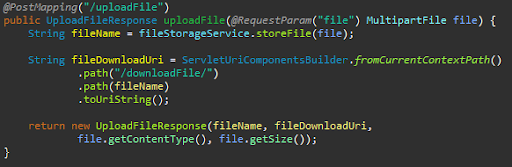

1. Otwarta funkcjonalność wysyłania plików bezpośrednio do folderu na serwerze ❌ 
2. Potencjalna możliwość pobierania plików z dowolnego katalogu na serwerze ❌
3. Aplikacja nie sprawdza poprawności adresu URL podanego przez użytkownika ❌
4. Brak weryfikacji zawartości pliku ❌ 
5. Brak blokady localhosta (we wszystkich jego postaciach) w URL ❌

**Rekomendacje**:
1. Jeśli podjęta została by decyzja o dalszym rozwoju aplikacji należałoby wprowadzać poprawki oraz weryfikować potencjalne zagrożenia.
2. Wdrożenie procesu obejmującego zautoatyzowane skanery, przegląd kodu i testy penetracyjne
3. Zastosowanie programu Jenkins
4. Przesyłanie plików na serwer:
    - Utworzenie systemu walidacji przesyłanych plików, np. przy użyciu odpowiednich bibliotek takich jak *JDBC* (Java DataBase Connectivity)
    - Utworzenie sysytemu walidacji schematów, z których pobierane są zasoby (zezwolić jedynie na http i https)
    - W miejscach gdzie przyjmowany ma być tylko jeden rodzaj pliku, bądź tylko wąski przedział rodzajów plikow zastosować parsowanie URL-a w celu weryfikacji jego zawartości przy pomocy np: *GroupDocs.Parser*

### A05:2021 - Security Misconfiguration

**Poziom ryzyka**: 1/5 

**Opis**: Program nie udostępnia publicznie plików tymczasowych ani logów. Dzięki temu osoby niepożądane nie mają do nich dostępu i nie mogą wykorzystać zawartych w nich danych. Nie znaleziono również żadnych podejrzanych katalogów.

Nie znaleziono plików, które nie powinny być widoczne dla przeciętnego użytkownika, takich jak: 
- .git
- Backupy
- Logi
- Tymczasowe pliki z edytorów tekstu

Aplikacja dostarczona została jako kod źródłowy bez plików konfiguracyjnych, ani plików obsługujących jakiekolwiek serwery (nie ma do nich dostępu). 
Uruchamianie aplikacji polega na wystartowaniu Apache Tomcat - kontenera aplikacji jako serwer w domyślnej konfiguracji (np. polegającej na wybranym porcie (8080)). Web Application Firewall (WAF) nie jest wprowadzony.

**Co to jest WAF?** WAF może być wirtualnym lub fizycznym urządzeniem, które zapobiega wykorzystywaniu luk w aplikacjach internetowych. Luki te mogą wynikać z tego, że sama aplikacja jest przestarzała lub nie została odpowiednio zakodowana w momencie tworzenia. WAF rozwiązuje te niedociągnięcia w kodzie, stosując specjalne konfiguracje zestawów reguł, znanych również jako polityki bezpieczeństwa.

**Rekomendacje**: 
1. Wprowadzić firewall np poprzez *Akamai Kona Site Defender*, bądź *AWS WAF*
2. Ukryć aplikacje za serwerem takim jak Apache (to może ograniczyć ilość zapytań, wprowadzić logi itd.)

### A06:2021 - Vulnerable and Outdated Components

**Poziom ryzyka**: 5/5

**Opis:** Program nie posiada mechanizmu sprawdzania aktualności używanych bibliotek (opartych o Maven), co umożliwia exploit znanych podatności dla starszych ich wersji. Podatności dla używanych komponentów można sprawdzić np. na stronie mvnrepository.com.

1. org.apache.commons > commons-collections4

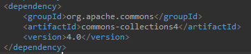

Rys. Wersja używana w programie

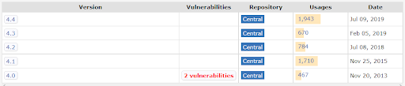

Rys.Aktualna wersja ze strony `mvnrepository.com`

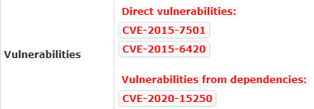

Rys. Znane podatności wersji 4.0

CVE-2020-15250: (Poziom ryzyka: 5.5/10)
- CWE - 732 (desc.): The product specifies permissions for a security-critical resource in a way that allows that resource to be read or modified by unintended actors.
- CWE - 200 (desc.): The product exposes sensitive information to an actor that is not explicitly authorized to have access to that information.

CVE-2015 -7501 oraz -6420: (Poziom ryzyka:  **9.8**/10 (Critical!) )
- CWE - 502 (description): The application deserializes untrusted data without sufficiently verifying that the resulting data will be valid.

2. Spring boot

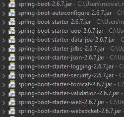

Rys. Wersja używana w programie

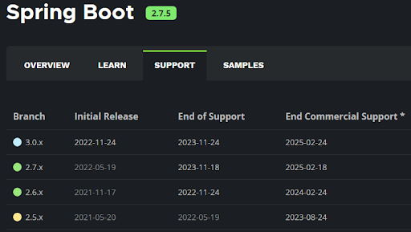

Rys. Aktualna wersja ze strony wydawcy

**Rekomendacje:**
- Spring boot aktualizuje wersje co około pół roku i gwarantuje wsparcie przez rok od daty wydania. Dlatego należy aktualizować ten komponent co najmniej co 12 miesięcy.
- Sprawdzać regularnie wersje używanych komponentów i w miarę możliwości je aktualizować.
- Monitorować luki, które mogą pojawić się w danej wersji Spring boot'a.

### A07:2021 - Identification and Authentication Failures 
**Poziom ryzyka**: 4/5

**Opis:** Program nie posiada mechanizmu sprawdzania aktualności używanych bibliotek, co umożliwia exploit znanych podatności dla starszych ich wersji. Podatności dla używanych komponentów można sprawdzić np. na stronie mvnrepository.com.

1. brak 2FA / MFA - ❌
2. brak kont testowych admin/admin - ✔️
3. hasła są przechowywane jako plain text bez algorytmu kryptograficznego - ❌
4. jakość haseł nie jest kontrolowana (typu wymagane: 8 liter, 1 cyfra, 1 znak specjalny  - “qwerty” jest dostępne) - ❌
   - przykładowo: brak 🧂solenia haseł przed haszowaniem jak w np: ARGON2

**Rekomendacje**:
- Zastosowanie mechanizmów lub algorytmów sprawdzających/szyfrujących jednostronnie:
    - Zastosowanie algorytmu ARGON2 lub bcrypt
    - Wprowadzenie mechanizmu 2FA/MFA
- Zastosowanie mechanizmów wymagających od użytkownika wprowadzenia znaków specjalnych, liczb, wielkich i małych liter oraz powtórzenia hasła przy jego tworzeniu
- Wprowadzić mechanizm odzyskiwania hasła
- Wproawdzic mechanizm uwierzytelniania wieloskładnikowego
- Wprowadzić mechanizm monitorowania prób włamania (np. przez notyfikacje mailową)

### A08:2021 - Software and Data Integrity Failures 
**Poziom ryzyka**: 1/5

**Opis:** W aplikacji nie znaleziono błędów związanych z integralnością danych. Przykładami problemów z nią zwiazanych są np.: wtyczki i biblioteki z niezaufanych źródeł lub pominięcie sprawdzenia integralności przy automatycznej aktualizacji - lecz w badanej aplikacji nie wykryto takich błędów. 
W przypadku dalszego rozwoju aplikacji można zastosować mechanizm aktualizacji, lecz aktualnie nie jest to konieczne, ponieważ aplikacja jest bardzo prosta.

1. Wszystkie wtyczki, biblioteki i moduły pochodzą z zaufanych źródeł ✔️
2. Brak aktualizacji ❌ (W tym przypadku nie ma aktualizacji, ale też nie są potrzebne, ponieważ strona nie jest “żywa” nic się tam nie zmienia, nie ma ruchu)
3. Brak niebezpiecznej serializacji/deserializacji (modyfikacji danych z postaci obiektu w javie na np plik typu JSON / na odwrót) ✔️

**Rekomendacje**: 
- W celu poprawienia bezpieczeństwa można zintegrować aplikację z narzędziem monitorującym bezpieczeństwo - często narzędzia te same potrafią podjąć decyzje i załatać lukę. 
- Zastosowanie narzędzi do monitorowania np *SolarWinds* / *Datadog*

### A09:2021 - Security Logging & Monitoring Failures
**Poziom ryzyka**: 4/5

**Opis:** Aplikacja nie posiada żadnego mechanizmu tworzenia logów o wydarzeniach występujących w działaniu aplikacji. Przez to monitorowanie błędów jest znacznie utrudnione i po fakcie ciężko jest dotrzeć do źródła problemu.

1. Brak jakiejkolwiek formy log’ów oraz wypisywania danych na temat zaistniałych eventów ❌
2. Brak mechanizmu monitorowania błędów / awarii ❌

**Rekomendacje**: Przechowywać logi można na 2 podstawowe sposoby:
1. W bazie danych aplikacji - co przy niewielkiej ich ilości jest najprostszym rozwiązaniem
-  łatwość filtrowania
- szybkość odczytu i zapisu
- częstsze kopie zapasowe
2. W systemie plików - jeśli zależy nam na łatwym dostępie, nawet w przypadku awarii.
- zmniejsza to obciążenie bazy danych
- możliwość kompresji i migracji logów (np. do prywatnej chmury)
- można logować błędy bazy danych

Przykładowym zastosowaniem komercyjnym może być AWS Cloud, który charakteryzuje się wysokim poziomem zabezpieczeń, niezawodności i wsparcia technicznego oraz niskimi kosztami (płatność subskrypcyjna za wykorzystane usługi).


### A10:2021 - Server-Side Request Forgery (SSRF)
**Poziom ryzyka**: 0/5

**Opis:** Podatność Server-Side Request Forgery (SSRF) pozwala osobom przeprowadzającym ataki z internetu na wykonywanie skanowania lub pobierania zasobów z sieci lokalnej. W aplikacji nie znaleziono podatności na takie ataki.

**Rekomendacje**: 
Brak - nie są wymagane żadne poprawki do podatności

---

### Wykonane prace

| Kategoria  |        Fragment raportu        | Tytus Kołpak | Łukasz Marcjan | Hubert Mosz |
| :--------: | :----------------------------: | :----------: | :------------: | :---------: |
| **Ogólne** |    Stowrzenie dokumentu md     |      ✔       |                |             |
|            |    Utworzenie spisu treści     |      ✔       |                |             |
|            |       Cel i zakres badań       |      ✔       |       ✔        |      ✔      |
|            |         Zakres audytu          |      ✔       |       ✔        |      ✔      |
|            |     Informacje o aplikacji     |      ✔       |       ✔        |      ✔      |
|            | Tabela testowanych komponentów |      ✔       |                |             |
|  **A01**   |              Opis              |      ✔       |       ✔        |      ✔      |
|            |             Treść              |      ✔       |       ✔        |      ✔      |
|            |          Rekomendacje          |      ✔       |                |      ✔      |
|  **A02**   |              Opis              |              |                |      ✔      |
|            |             Treść              |      ✔       |       ✔        |             |
|            |          Rekomendacje          |      ✔       |                |             |
|  **A03**   |              Opis              |              |       ✔        |             |
|            |             Treść              |              |       ✔        |      ✔      |
|            |          Rekomendacje          |              |       ✔        |             |
|  **A04**   |              Opis              |              |                |      ✔      |
|            |             Treść              |              |                |             |
|            |          Rekomendacje          |              |                |      ✔      |
|  **A05**   |              Opis              |      ✔       |                |             |
|            |             Treść              |      ✔       |                |             |
|            |          Rekomendacje          |      ✔       |       ✔        |             |
|  **A06**   |              Opis              |              |                |      ✔      |
|            |             Treść              |              |                |      ✔      |
|            |          Rekomendacje          |              |                |      ✔      |
|  **A07**   |              Opis              |              |       ✔        |             |
|            |             Treść              |      ✔       |                |      ✔      |
|            |          Rekomendacje          |      ✔       |       ✔        |             |
|  **A08**   |              Opis              |              |                |      ✔      |
|            |             Treść              |      ✔       |       ✔        |             |
|            |          Rekomendacje          |      ✔       |                |             |
|  **A09**   |              Opis              |              |                |      ✔      |
|            |             Treść              |              |       ✔        |             |
|            |          Rekomendacje          |              |                |      ✔      |
|  **A10**   |              Opis              |      ✔       |       ✔        |             |
|            |             Treść              |      ✔       |                |             |
|            |          Rekomendacje          |      ✔       |       ✔        |             |
| **Ogólne** |          Podsumowanie          |      ✔       |       ✔        |      ✔      |
|            |     Tabela wykonanych prac     |      ✔       |                |      ✔      |